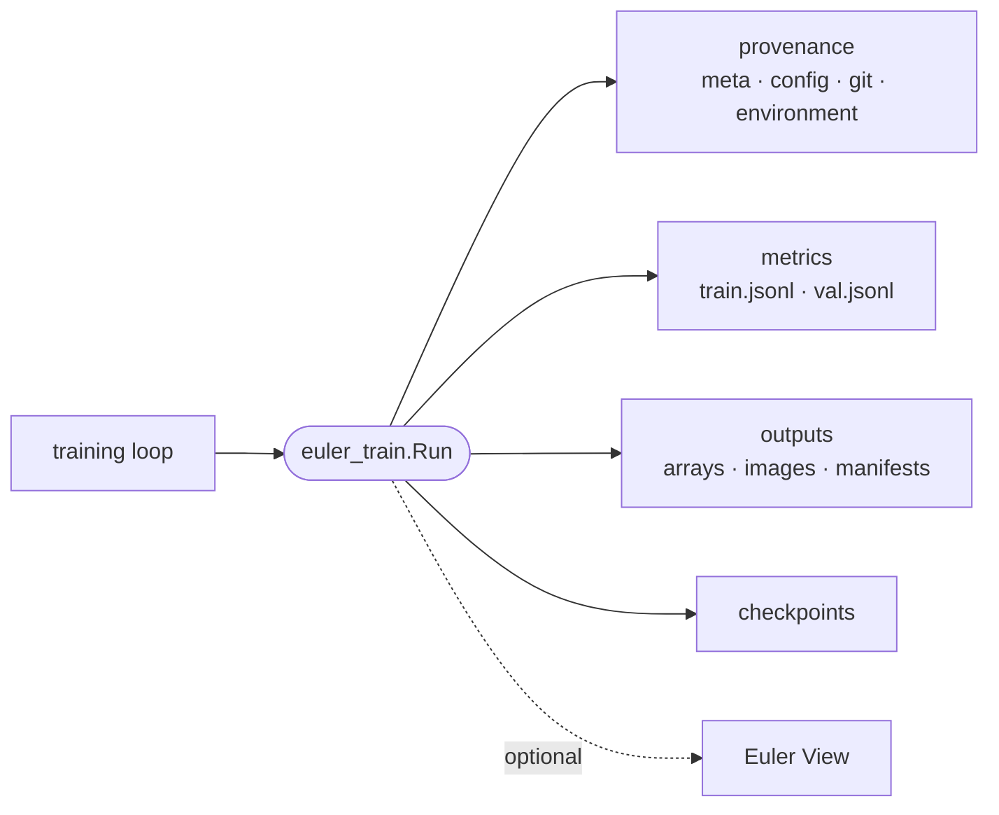

<h1 align="center">euler-train</h1>

<p align="center">
  <em>Local-first experiment tracking for PyTorch — structured metrics, outputs and provenance, without a tracking server.</em>
</p>

<p align="center">
  <a href="https://pypi.org/project/euler-train/"></a>
  <a href="https://pypi.org/project/euler-train/"></a>
  <a href="LICENSE"></a>
  <a href="https://github.com/d-rothen/euler-train/actions/workflows/ci.yml"></a>
</p>

---

Experiment trackers are useful until the network is unavailable, a cluster job
cannot reach the service, or the service itself changes. euler-train keeps the
durable record where the work happened: ordinary JSON, JSONL, NumPy and image
files in the run directory.

One `Run` records the training configuration, source revision, environment,
metrics, model outputs, checkpoints and lifecycle state. The directory remains
readable with standard tools, and can optionally be streamed to Euler View as a
best-effort secondary destination.



## Install

```bash
pip install "euler-train[images]"
```

Requires Python 3.9+. PyTorch is deliberately not a core dependency: the
package is intended to live inside an existing training environment. The
`[images]` extra supports the PNG outputs used below; for metrics and checkpoint
bookkeeping alone, `pip install euler-train` is enough.

Install only the integrations you use:

```bash
pip install "euler-train[images,gpu]"          # PNG output + NVIDIA metrics
pip install "euler-train[architecture]"        # weightless ONNX export
pip install "euler-train[datasets]"            # ds-crawler metadata fallback
pip install "euler-train[yaml]"                # YAML config files
pip install "euler-train[naming]"              # structured metric naming
```

## Quick start

```python
import euler_train

epochs = 50
global_step = 0

with euler_train.init(
    dir="experiments/dehazing",
    run_name="unet-baseline",
    config={"lr": 1e-4, "architecture": "unet", "epochs": epochs},
) as run:
    for epoch in range(epochs):
        for batch in train_loader:
            loss = train_step(model, batch)
            global_step += 1
            run.log(
                {"loss": loss.item(), "lr": optimizer.param_groups[0]["lr"]},
                step=global_step,
                epoch=epoch,
            )

        metrics, prediction, target = evaluate(model, val_loader)
        run.log(metrics, step=global_step, epoch=epoch, mode="val")
        run.save_outputs(
            epoch=epoch,
            step=global_step,
            rgb={"pred": prediction, "gt": target},
        )
        run.save_checkpoint(
            model,
            epoch=epoch,
            step=global_step,
            optimizer=optimizer,
        )
```

The context manager marks clean exits as `completed`, records uncaught
exceptions as `crashed`, and records `SIGINT`/`SIGTERM` as `interrupted` before
re-raising or forwarding the event.

## What you get

| | |
|---|---|
| **Local-first** | Files are always written before optional stream events; logging does not depend on a service or account. |
| **Reproducibility snapshot** | Every fresh run captures config, Git revision and dirty diff, Python/packages, CUDA/GPU details and SLURM allocation. |
| **Append-only metrics** | Training and validation records are JSONL, with step, epoch, wall time and optional GPU utilization added automatically. |
| **Structured outputs** | Predictions, targets, inputs and auxiliary arrays are saved as PNG/NPY/NPZ with a manifest for every snapshot. |
| **Dataset-aware IDs** | Batches from [euler-loading](https://github.com/d-rothen/euler-loading) retain stable sample IDs and dataset provenance. |
| **Checkpoint bookkeeping** | Save checkpoints directly or register files written by another framework; paths and best-checkpoint state land in `meta.json`. |
| **Resume and evaluation** | Reopen a run by ID or path, preserve its history, and attach named evaluation records and per-mode lifecycle state. |
| **Optional live view** | Best-effort event consumers can mirror a run to Euler View without weakening the on-disk source of truth. |

## On disk

Each call creates a timestamped run under `<project>/runs/`:

```text
experiments/dehazing/
└── runs/
    └── 2026-08-04_14-32-10_a3f2/
        ├── meta.json
        ├── config.json
        ├── code_ref.json
        ├── run_environment.json
        ├── train.jsonl
        ├── val.jsonl
        ├── checkpoints/
        │   └── epoch_4.pt
        └── outputs/
            └── epoch_4_step_2500/
                ├── manifest.json
                └── rgb/
                    ├── pred/
                    └── gt/
```

`run.run_id` is the generated identifier and `run.dir` is the concrete run
directory. See [Run file format](docs/run-format.md) for the complete layout
and schemas.

## Named outputs from a batch

`save_outputs_from_batch()` turns the `full_id` or `id` values in a collated
batch into stable filenames. When the dataset exposes `describe_id_schema()`,
the helper can also add that schema to the output manifest:

```python
run.save_outputs_from_batch(
    batch=batch,
    dataset=val_dataset,
    epoch=epoch,
    step=global_step,
    metadata={"dataset": "vkitti2", "split": "val"},
    rgb={"pred": prediction, "gt": batch["rgb"]},
    depth={"pred": depth_prediction},
)
```

## Optional streaming

Local files remain authoritative when streaming is enabled:

```python
import os

run = euler_train.init(
    dir="experiments/dehazing",
    config=config,
    stream={
        "base_url": os.environ["EULER_VIEW_BASE_URL"],
        "api_token": os.environ["EULER_VIEW_API_TOKEN"],
        "stream_attach_token": os.environ["EULER_VIEW_STREAM_ATTACH_TOKEN"],
    },
)
```

Network failures are warned about and buffered within configured limits; they
do not stop the training loop. See [Euler View streaming](docs/streaming.md)
for session modes, SLURM matching, connectivity checks and custom consumers.

## Documentation

| Guide | Covers |
|---|---|
| [API and workflows](docs/api.md) | Initialization, metrics, checkpoints, resume, datasets, evaluations, modes and lifecycle |
| [Saving model outputs](docs/outputs.md) | Slot structure, batch-aware naming, manifests, format inference and PNG visualization |
| [Run file format](docs/run-format.md) | Directory layout and the `meta.json`, provenance, environment and metric records |
| [Euler View streaming](docs/streaming.md) | Authentication, attachment, dry-run checks, buffering and custom stream consumers |
| [`meta.json` JSON Schema](meta-schema.json) | Machine-readable run metadata contract |

## Development

```bash
git clone https://github.com/d-rothen/euler-train.git
cd euler-train
pip install -e ".[dev]"
pytest
```

See [CONTRIBUTING.md](CONTRIBUTING.md) for project conventions and the release
workflow.

## License

[MIT](LICENSE) © Daniel Rothenpieler
